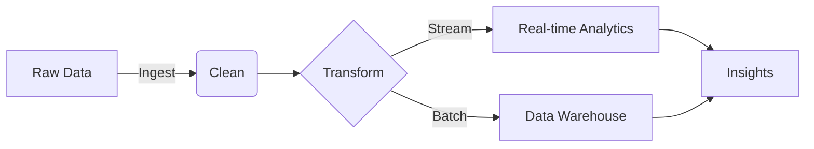

# Hello, Data Engineering World! 

> "Data is the new oil, but like oil, it's valuable only when refined." 

I'm a Python Big Data Software Developer passionate about building scalable data pipelines and distributed systems. I transform raw data into actionable insights through elegant and efficient solutions.

## 🛠️ Tech Arsenal

### Core Technologies


### Big Data & Streaming
- **Data Processing Frameworks**: Apache Spark, Hadoop Ecosystem
- **Stream Processing**: Spark Streaming, Real-time Analytics
- **Data Warehousing**: 
  - Columnar Stores (Parquet, ORC)
  - MPP Databases
  - Data Lakes Architecture

### Infrastructure & DevOps
- **Containerization**: Docker, Kubernetes
- **Cloud Platforms**: AWS/GCP Infrastructure
- **CI/CD**: GitLab, GitHub Actions
- **IaC**: Terraform

### Database Technologies
- **Relational**: PostgreSQL, MySQL
- **Vector DBs**: Pinecone, FAISS, 

## 💡 Featured Projects

### Data Pipeline Orchestra
*Orchestrating harmony in chaos*
- Built a fault-tolerant data pipeline processing 1TB+ daily
- Reduced processing time by 60% through optimization
- Implemented real-time monitoring and alerting
```python
def process_data(spark_session, data_source):
    return (spark_session.read
            .format("delta")
            .load(data_source)
            .transform(clean_data)
            .transform(enrich_data))
```

### Scale Master
*Because size matters in this particular case*
- Designed horizontal scaling architecture
- Handles 10K+ events per second
- 99.99% uptime achievement

## 📈 Performance Metrics



## 🌱 Current Learning Journey

- Exploring LLMs for agentic applications
- Diving deep into MLOps, like monitoring said LLMs
- Studying distributed systems patterns

## 🎯 Professional Philosophy

I believe in:
- Writing self-documenting code
- Building systems that scale horizontally
- Monitoring everything that moves
- Testing until it breaks

## 📫 Let's Connect!

[LinkedIn](https://www.linkedin.com/in/hugo-valent-515b7ba0/) | [Tech Blog](https://hugovalent.com)

---
<p align="center">
<i>This page is powered by coffee ☕ and curiosity 🔍</i>
</p>

<!-- Easter egg: Hover over the coffee cup! -->
<style>
i:hover {
    color: #FFD700;
    transition: color 0.3s ease;
}
</style>